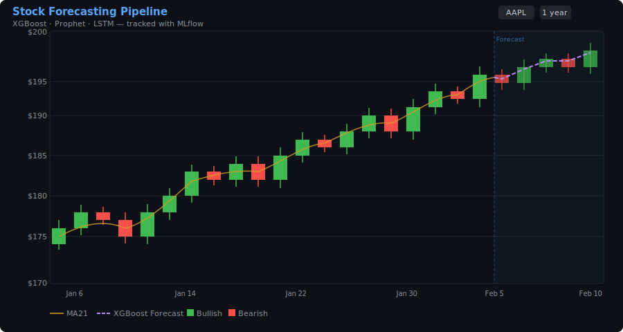
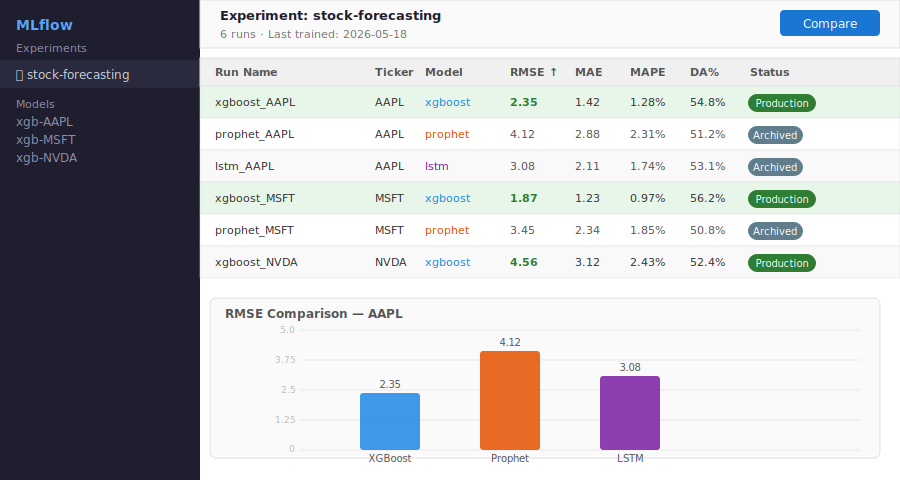
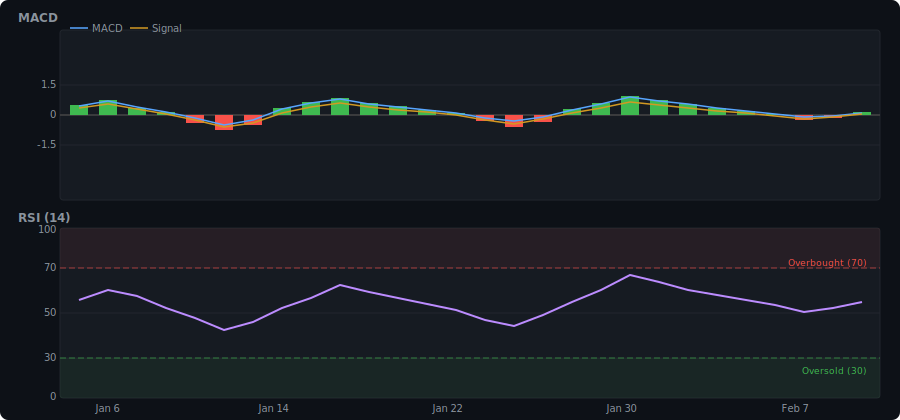
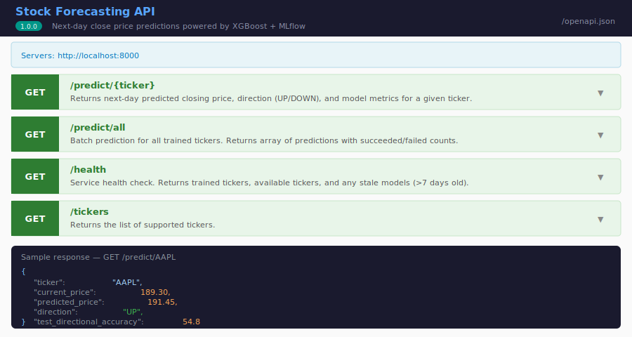
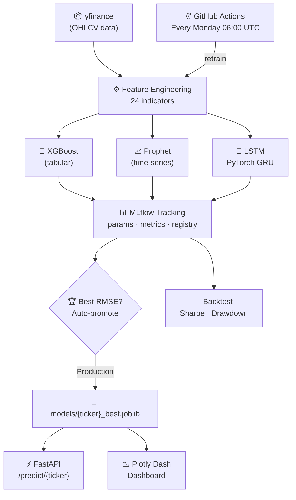

<div align="center">

# Stock Forecasting Pipeline

**A production-grade MLOps pipeline that trains three competing models on real stock data,
tracks every experiment with MLflow, auto-promotes the winner to Production,
and serves live predictions through a REST API and an interactive dashboard.**

[](https://github.com/OzSpidey/ml-forecasting-pipeline/actions/workflows/ci.yml)
[](https://python.org)
[](https://xgboost.readthedocs.io)
[](https://pytorch.org)
[](https://mlflow.org)
[](https://fastapi.tiangolo.com)
[](https://dash.plotly.com)
[](https://docs.docker.com/compose)
[](https://optuna.org)
[](LICENSE)

</div>

---

## What This Project Does

Most forecasting demos train a single model on a single stock and call it done.
This pipeline does what a production ML team actually does:

- **Three competing models**, XGBoost (tabular gradient boosting), Prophet (time-series decomposition), and a PyTorch LSTM, trained head-to-head on the same data
- **24 engineered features**, RSI, MACD, Bollinger Bands, realised volatility, lag features, and calendar features
- **Full MLflow experiment tracking**, every run logged: params, metrics, artifacts, model registry
- **Auto-promotion**, the model with the best test-set RMSE is automatically promoted to the `Production` stage in the MLflow registry
- **Walk-forward backtesting**, simulates real trading with expanding-window retraining; reports Sharpe ratio, max drawdown, and comparison against buy-and-hold
- **Optuna hyperparameter tuning**, 50-trial Bayesian search over XGBoost's param space
- **FastAPI prediction service**, `/predict/{ticker}`, `/predict/all`, `/health` with model staleness detection
- **Plotly Dash dashboard**, candlestick chart with forecast overlay, MACD, RSI, and model leaderboard
- **Fully containerised**, single `docker-compose up` brings up MLflow, the API, and the dashboard
- **Automated retraining**, GitHub Actions runs the full pipeline every Monday at 06:00 UTC

---

## Screenshots

| Dashboard, Candlestick + Forecast Overlay | MLflow Experiment Tracker |
|:---:|:---:|
|  |  |

| Technical Indicators, MACD + RSI | FastAPI Swagger Docs |
|:---:|:---:|
|  |  |

---

## Architecture



---

## Quick Start

### 1, Install

```bash
git clone https://github.com/OzSpidey/ml-forecasting-pipeline.git
cd ml-forecasting-pipeline
pip install -r requirements.txt
```

### 2, Train

```bash
# Train all 5 tickers (AAPL · MSFT · TSLA · NVDA · SPY)
python retrain.py

# Faster: specific tickers, skip the LSTM
python retrain.py --tickers AAPL NVDA --no-lstm

# With Optuna hyperparameter tuning (50 trials per ticker)
python retrain.py --tickers AAPL --tune
```

<details>
<summary>Sample terminal output</summary>

```
================================================
  AAPL
================================================
  753 trading days loaded
  XGBoost | RMSE=2.35  DA=54.8%
  Prophet | RMSE=4.12  DA=51.2%
  LSTM    | RMSE=3.08  DA=53.1%
  Backtest | Sharpe=0.84  Return=18.3%  MaxDD=-12.4%  B&H=14.1%
  [AAPL] Best overall: xgboost | RMSE=2.35 → Production

================================================
  LEADERBOARD
================================================
  Ticker   Model       RMSE     MAPE     DA%
  ------------------------------------------
  AAPL     xgboost     2.35    1.28%   54.8% ←
  AAPL     prophet     4.12    2.31%   51.2%
  AAPL     lstm        3.08    1.74%   53.1%

MLflow UI: mlflow ui --backend-store-uri sqlite:///mlflow.db
```

</details>

### 3, View MLflow

```bash
mlflow ui --backend-store-uri sqlite:///mlflow.db
# → http://localhost:5000
```

Compare all runs, inspect params/metrics, and see the model registry.

### 4, Start the API

```bash
uvicorn serve:app --reload
# → http://localhost:8000/docs
```

### 5, Launch the Dashboard

```bash
python dashboard.py
# → http://localhost:8050
```

---

## Docker (everything at once)

```bash
docker-compose up --build
```

| Service | URL |
|---|---|
| MLflow UI | http://localhost:5000 |
| FastAPI docs | http://localhost:8000/docs |
| Dash dashboard | http://localhost:8050 |

---

## API Reference

### `GET /predict/{ticker}`

Returns the next-day closing price prediction for a single ticker.

**Example:**
```bash
curl http://localhost:8000/predict/AAPL
```

```json
{
  "ticker": "AAPL",
  "current_price": 189.30,
  "predicted_price": 191.45,
  "expected_return_pct": 1.136,
  "direction": "UP",
  "model_used": "xgboost",
  "test_rmse": 2.35,
  "test_directional_accuracy": 54.8
}
```

### `GET /predict/all`

Batch prediction for all trained tickers.

### `GET /health`

Returns status, trained tickers, and any **stale models** (not retrained in > 7 days).

```json
{
  "status": "ok",
  "available_tickers": ["AAPL", "MSFT", "TSLA", "NVDA", "SPY"],
  "trained_tickers": ["AAPL", "MSFT"],
  "stale_tickers": []
}
```

---

## Features Engineered

| Category | Features |
|---|---|
| **Returns** | 1-day, 5-day, 10-day percentage returns |
| **Moving Averages** | MA7, MA21, MA50 |
| **MACD** | MACD line, signal line, histogram |
| **RSI** | 14-period Relative Strength Index |
| **Bollinger Bands** | Band width, price position within bands |
| **Volume** | 10-day rolling volume ratio |
| **Volatility** | 10-day and 30-day annualised realised volatility |
| **Lag Features** | Close / High / Low lagged 1, 2, 3, 5, 10 days |
| **Calendar** | Day of week, month |

---

## Models

### XGBoost (gradient boosting on tabular features)
- Uses all 24 engineered features
- `n_estimators=500`, `max_depth=6`, `learning_rate=0.05`
- Optional Optuna tuning with 50 Bayesian trials

### Prophet (time-series decomposition)
- Captures yearly + weekly seasonality with a custom monthly component
- `seasonality_mode=multiplicative`
- Works on raw close price, no feature engineering needed

### LSTM (PyTorch, sequence model)
- 2-layer LSTM, hidden size 64, dropout 0.2
- Trained on 30-day sequences of all 24 features + close
- Gradient clipping to prevent exploding gradients
- MinMaxScaler on input, inverse-transformed on output

---

## Backtesting

The walk-forward backtester (`src/backtest.py`) re-trains on an expanding window at each step, no data leakage. It goes long when the model predicts an up day and holds cash otherwise:

| Metric | Description |
|---|---|
| **Sharpe Ratio** | Annualised risk-adjusted return (strategy) |
| **Max Drawdown** | Worst peak-to-trough loss |
| **Total Return %** | Cumulative return over the test period |
| **B&H Return %** | Buy-and-hold baseline for comparison |

All metrics are logged to MLflow alongside training metrics.

---

## Unit Tests

```bash
pytest tests/ -v
```

| Test | What it checks |
|---|---|
| `test_all_feature_cols_present` | All 24 features are in the output DataFrame |
| `test_no_nulls_in_features` | No NaN values after feature engineering |
| `test_target_is_next_close` | Target column correctly aligns with next day's close |
| `test_rsi_bounds` | RSI is always in [0, 100] |
| `test_bb_position_finite` | Bollinger Band position has no inf/NaN values |
| `test_perfect_prediction` | RMSE and MAE are 0 for perfect predictions |
| `test_directional_accuracy_all_correct` | DA% is 100 when direction is always right |
| `test_metric_keys` | All four metric keys are present in every result |

---

## Project Structure

```
ml-forecasting-pipeline/
│
├── src/
│   ├── config.py            ← tickers, hyperparams, MLflow URI
│   ├── fetch.py             ← yfinance OHLCV fetcher
│   ├── features.py          ← 24 technical indicators + lag features
│   ├── train_xgboost.py     ← XGBoost training + MLflow logging
│   ├── train_prophet.py     ← Prophet training + MLflow logging
│   ├── train_lstm.py        ← PyTorch LSTM training + MLflow logging
│   ├── evaluate.py          ← RMSE, MAE, MAPE, directional accuracy
│   ├── backtest.py          ← walk-forward backtest, Sharpe, drawdown
│   ├── tune.py              ← Optuna 50-trial hyperparameter search
│   └── register.py          ← auto-promote best model to Production
│
├── tests/
│   ├── test_features.py     ← feature engineering unit tests
│   └── test_evaluate.py     ← metric computation unit tests
│
├── screenshots/             ← add your own after running the app
│
├── retrain.py               ← training orchestrator
├── serve.py                 ← FastAPI: /predict, /predict/all, /health
├── dashboard.py             ← Plotly Dash interactive dashboard
│
├── pyproject.toml           ← project metadata + pytest config
├── requirements.txt
├── Dockerfile
├── docker-compose.yml
│
└── .github/workflows/
    ├── ci.yml               ← pytest on every push
    └── retrain.yml          ← full retraining every Monday 06:00 UTC
```

---

## Configuration

Edit `src/config.py` to customise:

```python
TICKERS       = ["AAPL", "MSFT", "TSLA", "NVDA", "SPY"]  # add any ticker
TRAIN_PERIOD  = "3y"       # how far back to fetch data
TEST_SPLIT    = 0.15       # last 15% of data used for evaluation
LSTM_EPOCHS   = 50         # reduce to 20 for faster training
LSTM_SEQ_LEN  = 30         # days of history per LSTM input sequence
```

---

## License

MIT, use freely, attribution appreciated.

---

<div align="center">
  Built by <a href="https://github.com/OzSpidey">Osborne Lopes</a>
</div>
